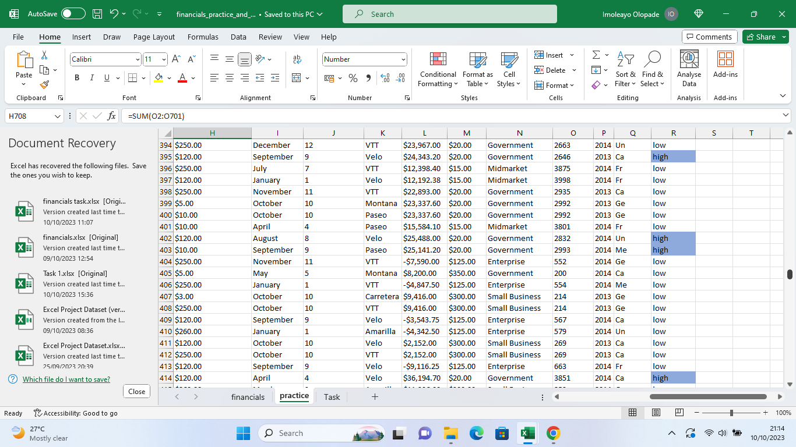

# Excel formula and functions

A sales data set was provided by my tutor and i was asked to perform some tasks like sum, average, getting mininum and maximum values, getting the number of records in the data set, creating a column bearing the first two letters of countries, differentiating profit into 'High' and 'Low' based on the average profit as practice.

Attached below is my 'worked on' Microsoft Excel file. 

I calculated, 
1. The sum of the profit using '=SUM(L2:L701),
2. The average of profit using '=AVERAGE(L2:L701)
3. The sum of sales using '=SUM(A2:A701)
4. The average of sales using '=AVERAGE(A2:A701)
5. The sum of units sold '=SUM(O2:O701)
6. The average units sold '=AVERAGE(O2:O701)
7. The highest profit values '=MAX(L2:L701)
8. The least profit values '=MIN(L2:L701)
9. The number of records in the data set '=COUNT(A2:A701)

 To let profit above average to return High and values below average to return low, I created a new column labeled 'Profit Band',  used  =IF(L2>$H$705,"High","Low"), then I autofilled. I also highlighted the 'High's for better visibility using conditional formatting.

 

To provide the first two letters of the countries in focus,I created a new column, used '=LEFT(C2,2), then I auto filled

___

Using the same sales data, I was tasked with calculating the total revenue and profit generated, the average revenue and units sold for every order, the total discount given in $, the total number of sales recorded and the highest profit generated.

I calculated these as follows:
   1. Total revenue =SUM(A2:A701)
   2. Total profit =SUM(L2:L701)
   3. Average revenue =AVERAGE(A2:A701)
   4. Average units sold =AVERAGE(O2:O701)
   5. Total discount in $ =SUM(F2:F701)
   6. Total number of sales recorded =COUNT(A2:A701)
   7. Maximum profit generated =MAX(L2:L701)

 

 
 
 
To differentiate the sales values between High sales and Low sales based on the average, I used =IF(A2>$B$708,"High Sales","Low Sales") in a new column labeled 'Sales Range'
